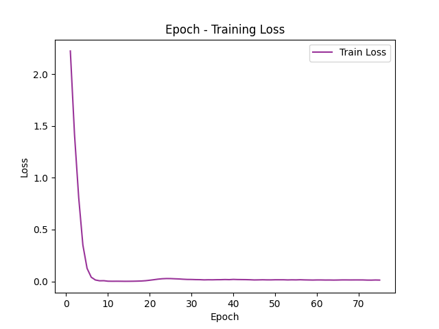

# GNN4Cora
A hands-on course mini-project of CSE5002 Intelligent Data Analysis, SUSTech 2022. The project aims to have students evaluate some classification models using the Cora dataset. This repository mainly focuses on GNN - Graph Neural Network models.

**For detailed explanations about how to set up the environment and run the code, please check [`GNN4Cora.ipynb`](GNN4Cora.ipynb).**

**For a complete work flow demonstration, please check https://drive.google.com/file/d/1ZyLTXgGcWOLmPE0lKd1rb3FqZTy6wmnO/view?usp=sharing.**

<br>

## Preprocess

In [`preprocess/CoraPreprocessor.py`](preprocess/CoraPreprocessor.py), the Cora Dataset is downloaded and preprocessed. This operation should be called before any training process. To see how it works, write:

```bash
python CoraPreprocessor.py --help
```

The command-line arguments are listed below:

```pseudocode
usage: CoraPreprocessor.py [-h] [-dr DATA_DIR]

optional arguments:
  -h, --help            show this help message and exit
  -dr DATA_DIR, --data_dir DATA_DIR
                        Root directory of the input data, default =
                        ../data/cora/
```

As an example, we can run as:

```bash
python CoraPreprocessor.py -dr ../data/cora/
```

Note that the `data/` directory should be created beforehand.

After preprocessing the data, the data directory will look like this:

```pseudocode
total 53M
-rwxrwxrwx 1 rainbow rainbow 1.6K Feb 19  2007 README
-rwxrwxrwx 1 rainbow rainbow  69K Feb 19  2007 cora.cites
-rwxrwxrwx 1 rainbow rainbow 7.5M Feb 19  2007 cora.content
-rwxrwxrwx 1 rainbow rainbow  45M May 27 23:22 cora.dgl
-rwxrwxrwx 1 rainbow rainbow 165K May 26 15:09 cora.tgz
-rwxrwxrwx 1 rainbow rainbow  42K May 27 23:22 meta.json
```

`cora.tgz`, `README`, `cora.cites` and `cora.content` are raw data downloaded from the internet. `meta.json` records some basic information about the preprocessed dataset. It looks like the following:

```pseudocode
{
  "num_nodes": 2708,
  "num_edges": [
    5429,
    5429,
    10556
  ],
  "num_feats": 1433,
  "num_classes": 7,
  "label_map": {
    "Case_Based": 0,
    "Genetic_Algorithms": 1,
    "Neural_Networks": 2,
    "Probabilistic_Methods": 3,
    "Reinforcement_Learning": 4,
    "Rule_Learning": 5,
    "Theory": 6
  },
  "relationship_map": {
    "citing": 0,
    "cited": 1,
    "both": 2
  },
  "id_map_pub2node": {
    "31336": 0,
    "1061127": 1,
    "1106406": 2,
    ...
    "1128978": 2705,
    "117328": 2706,
    "24043": 2707
  }
}
```

There number of nodes, edges are recorded. In the preprocessing stage, we construct three graphs for the experiment as listed in `relationship_map`: "citing" which consider the publications one cites as its neighbors, "cited" which does the opposite compared to "citing" and "both" which forms an bidirected graph. The feature dimension and output dimension (number of classes) are also stored. `label_map` shows how the labels are mapped from strings to numerical values. `id_map_pub2node` shows how a publication id in the raw data is mapped to a node id (which starts from 0 and is continuous).

`cora.dgl` stores a `dgl.DGLGraph` which includes the graph structure along with the features and labels for each node.

<br>

## Training

In [`Trainer.py`](Trainer.py), the specified model will be trained with a given dataset and evaluated afterwards. To see how it works, write:

```bash
python Trainer.py --help
```

The command-line arguments are listed below:

```pseudocode
usage: Trainer.py [-h] [-lr LEARNING_RATE] [-me MAX_EPOCHS] [-ef EVAL_FREQ]
                  [-lf LOSS_FUNCTION] [-opt OPTIMIZER] [-m MODE]
                  [-net NETWORK] [-fd FEATURE_DIM] [-hd HIDDEN_DIM]
                  [-od OUT_DIM] [-dr DATA_DIR] [-gpu GPU] [-gid GPU_ID]
                  [-ld LOG_DIR] [-tag TAG] [-md MODEL_SAVE_DIR] [-e EVAL]

optional arguments:
  -h, --help            show this help message and exit
  -lr LEARNING_RATE, --learning_rate LEARNING_RATE
                        Learning rate, default = 0.01
  -me MAX_EPOCHS, --max_epochs MAX_EPOCHS
                        Number of epochs to run the trainer, default = 75
  -ef EVAL_FREQ, --eval_freq EVAL_FREQ
                        Frequency of evaluation on the validation set, default
                        = 5
  -lf LOSS_FUNCTION, --loss_function LOSS_FUNCTION
                        Specify which loss function to use, default =
                        CrossEntropyLoss
  -opt OPTIMIZER, --optimizer OPTIMIZER
                        Optimizer to be used [ADAM], default = ADAM
  -m MODE, --mode MODE  Specify which mode the model runs in (train, eval,
                        trainNeval), default = trainNeval
  -net NETWORK, --network NETWORK
                        Specify which model/network to use, default = GaAN
  -fd FEATURE_DIM, --feature_dim FEATURE_DIM
                        Specify the feature dimension, default = 1433
  -hd HIDDEN_DIM, --hidden_dim HIDDEN_DIM
                        Specify the hidden dimension, default = 128
  -od OUT_DIM, --out_dim OUT_DIM
                        Specify the output dimension, default = 7
  -dr DATA_DIR, --data_dir DATA_DIR
                        Root directory of the input data, default = data/cora/
  -gpu GPU, --gpu GPU   Specify whether to use GPU, default = 1
  -gid GPU_ID, --gpu_id GPU_ID
                        Specify which GPU to use, default = 0
  -ld LOG_DIR, --log_dir LOG_DIR
                        Specify where to create a log file. If log files are
                        not wanted, value will be None
  -tag TAG, --tag TAG   Name tag for the model, default = None
  -md MODEL_SAVE_DIR, --model_save_dir MODEL_SAVE_DIR
                        Specify the location of network to be saved, default =
                        model_save/
  -e EVAL, --eval EVAL  Specify the location of saved network to be loaded for
                        evaluation, default = eval.pth
```

As an example, we can run as:

```bash
python Trainer.py -dr data/cora/ -m trainNeval -net GaAN -tag GaAN
```

With this command, the model "GaAN" will be trained **and evaluated**. The outputs will be forwarded to `stdout` and a created log file. The outputs look like the following (or check [`records/logs/GaAN_trainNeval_20220527_21_36_39.log`](records/logs/GaAN_trainNeval_20220527_21_36_39.log)):

```pseudocode
> Seed: 6666666
> device: cuda:0
> Loading DataSet from data/cora/
> Data sent to cuda:0
> view: both
> num_nodes: 2708, num_edges: [10556]
> num_feats: 1433, num_classes: 7
> num_samples: training = 270, validation = 812, test = 1626
> train_set_imbalance: {0: 28, 1: 35, 2: 79, 3: 50, 4: 22, 5: 20, 6: 36}
> Initializing the Training Model: GaAN
> Model Structure:
GaAN(
  (proj_fc): Linear(in_features=1433, out_features=128, bias=False)
  (embed_fc): Linear(in_features=128, out_features=128, bias=False)
  (layers): ModuleList(
    (0): ModuleList(
      (0): MultiHeadCGaANLayer(
        (cGaANs): ModuleList(
          (0): CGaANLayer(
            (Wa): Linear(in_features=128, out_features=128, bias=False)
            (att_out_fc_l): Linear(in_features=128, out_features=1, bias=False)
            (att_out_fc_r): Linear(in_features=128, out_features=1, bias=False)
            (gate_fc_l): Linear(in_features=128, out_features=1, bias=False)
            (gate_fc_m): Linear(in_features=128, out_features=1, bias=False)
            (gate_fc_r): Linear(in_features=128, out_features=1, bias=False)
            (Wgm): Linear(in_features=128, out_features=128, bias=False)
          )
          (1): CGaANLayer(
            (Wa): Linear(in_features=128, out_features=128, bias=False)
            (att_out_fc_l): Linear(in_features=128, out_features=1, bias=False)
            (att_out_fc_r): Linear(in_features=128, out_features=1, bias=False)
            (gate_fc_l): Linear(in_features=128, out_features=1, bias=False)
            (gate_fc_m): Linear(in_features=128, out_features=1, bias=False)
            (gate_fc_r): Linear(in_features=128, out_features=1, bias=False)
            (Wgm): Linear(in_features=128, out_features=128, bias=False)
          )
          (2): CGaANLayer(
            (Wa): Linear(in_features=128, out_features=128, bias=False)
            (att_out_fc_l): Linear(in_features=128, out_features=1, bias=False)
            (att_out_fc_r): Linear(in_features=128, out_features=1, bias=False)
            (gate_fc_l): Linear(in_features=128, out_features=1, bias=False)
            (gate_fc_m): Linear(in_features=128, out_features=1, bias=False)
            (gate_fc_r): Linear(in_features=128, out_features=1, bias=False)
            (Wgm): Linear(in_features=128, out_features=128, bias=False)
          )
        )
      )
      (1): MultiHeadCGaANLayer(
        (cGaANs): ModuleList(
          (0): CGaANLayer(
            (Wa): Linear(in_features=128, out_features=128, bias=False)
            (att_out_fc_l): Linear(in_features=128, out_features=1, bias=False)
            (att_out_fc_r): Linear(in_features=128, out_features=1, bias=False)
            (gate_fc_l): Linear(in_features=128, out_features=1, bias=False)
            (gate_fc_m): Linear(in_features=128, out_features=1, bias=False)
            (gate_fc_r): Linear(in_features=128, out_features=1, bias=False)
            (Wgm): Linear(in_features=128, out_features=128, bias=False)
          )
          (1): CGaANLayer(
            (Wa): Linear(in_features=128, out_features=128, bias=False)
            (att_out_fc_l): Linear(in_features=128, out_features=1, bias=False)
            (att_out_fc_r): Linear(in_features=128, out_features=1, bias=False)
            (gate_fc_l): Linear(in_features=128, out_features=1, bias=False)
            (gate_fc_m): Linear(in_features=128, out_features=1, bias=False)
            (gate_fc_r): Linear(in_features=128, out_features=1, bias=False)
            (Wgm): Linear(in_features=128, out_features=128, bias=False)
          )
          (2): CGaANLayer(
            (Wa): Linear(in_features=128, out_features=128, bias=False)
            (att_out_fc_l): Linear(in_features=128, out_features=1, bias=False)
            (att_out_fc_r): Linear(in_features=128, out_features=1, bias=False)
            (gate_fc_l): Linear(in_features=128, out_features=1, bias=False)
            (gate_fc_m): Linear(in_features=128, out_features=1, bias=False)
            (gate_fc_r): Linear(in_features=128, out_features=1, bias=False)
            (Wgm): Linear(in_features=128, out_features=128, bias=False)
          )
        )
      )
    )
  )
  (tran_fc): Linear(in_features=512, out_features=7, bias=True)
)
> Model sent to cuda:0
> Constructing the Optimizer: ADAM
> Using CrossEntropyLoss as the Loss Function.

learning_rate = 0.01, epochs = 75
eval_freq = 5, optimizer = ADAM

Start Training!
------------------------------------------------------------------------
Training Round 1: loss = 2.223528, time_cost = 4.1979 sec, acc = 17.0370%
Training Round 2: loss = 1.416553, time_cost = 0.4652 sec, acc = 45.9259%
Training Round 3: loss = 0.809024, time_cost = 0.5017 sec, acc = 81.1111%
Training Round 4: loss = 0.350865, time_cost = 0.4840 sec, acc = 97.4074%
Training Round 5: loss = 0.126183, time_cost = 0.5012 sec, acc = 98.8889%
!!! Evaluation: valid_acc = 72.6601%, test_acc = 74.1082%
Training Round 6: loss = 0.040574, time_cost = 0.5338 sec, acc = 99.6296%
Training Round 7: loss = 0.013757, time_cost = 0.4602 sec, acc = 99.6296%
Training Round 8: loss = 0.006113, time_cost = 0.4932 sec, acc = 99.6296%
Training Round 9: loss = 0.006870, time_cost = 0.4961 sec, acc = 99.6296%
Training Round 10: loss = 0.002176, time_cost = 0.4764 sec, acc = 100.0000%
!!! Evaluation: valid_acc = 77.5862%, test_acc = 79.4588%
Training Round 11: loss = 0.001610, time_cost = 0.4713 sec, acc = 100.0000%
Training Round 12: loss = 0.001822, time_cost = 0.4579 sec, acc = 100.0000%
Training Round 13: loss = 0.001648, time_cost = 0.5568 sec, acc = 100.0000%
Training Round 14: loss = 0.001144, time_cost = 0.5029 sec, acc = 100.0000%
Training Round 15: loss = 0.001322, time_cost = 0.4706 sec, acc = 100.0000%
!!! Evaluation: valid_acc = 78.6946%, test_acc = 78.4748%
Model: model_save/20220527_21_36_39.pth has been saved since it achieves higher validation accuracy.
Training Round 16: loss = 0.001828, time_cost = 0.4758 sec, acc = 100.0000%
Training Round 17: loss = 0.002809, time_cost = 0.4861 sec, acc = 100.0000%
...
Training Round 74: loss = 0.013630, time_cost = 0.4650 sec, acc = 100.0000%
Training Round 75: loss = 0.012812, time_cost = 0.4650 sec, acc = 100.0000%
!!! Evaluation: valid_acc = 81.6502%, test_acc = 83.0873%
> Training finished.

> device: cuda:0
> Loading DataSet from data/cora/
> Data sent to cuda:0
> view: both
> num_nodes: 2708, num_edges: [10556]
> num_feats: 1433, num_classes: 7
> num_samples: training = 270, validation = 812, test = 1626
> train_set_imbalance: {0: 28, 1: 35, 2: 79, 3: 50, 4: 22, 5: 20, 6: 36}
> Loading model_save/20220527_21_36_39.pth
> Model Structure:
GaAN(
  (proj_fc): Linear(in_features=1433, out_features=128, bias=False)
  (embed_fc): Linear(in_features=128, out_features=128, bias=False)
  (layers): ModuleList(
    (0): ModuleList(
      (0): MultiHeadCGaANLayer(
        (cGaANs): ModuleList(
          (0): CGaANLayer(
            (Wa): Linear(in_features=128, out_features=128, bias=False)
            (att_out_fc_l): Linear(in_features=128, out_features=1, bias=False)
            (att_out_fc_r): Linear(in_features=128, out_features=1, bias=False)
            (gate_fc_l): Linear(in_features=128, out_features=1, bias=False)
            (gate_fc_m): Linear(in_features=128, out_features=1, bias=False)
            (gate_fc_r): Linear(in_features=128, out_features=1, bias=False)
            (Wgm): Linear(in_features=128, out_features=128, bias=False)
          )
          (1): CGaANLayer(
            (Wa): Linear(in_features=128, out_features=128, bias=False)
            (att_out_fc_l): Linear(in_features=128, out_features=1, bias=False)
            (att_out_fc_r): Linear(in_features=128, out_features=1, bias=False)
            (gate_fc_l): Linear(in_features=128, out_features=1, bias=False)
            (gate_fc_m): Linear(in_features=128, out_features=1, bias=False)
            (gate_fc_r): Linear(in_features=128, out_features=1, bias=False)
            (Wgm): Linear(in_features=128, out_features=128, bias=False)
          )
          (2): CGaANLayer(
            (Wa): Linear(in_features=128, out_features=128, bias=False)
            (att_out_fc_l): Linear(in_features=128, out_features=1, bias=False)
            (att_out_fc_r): Linear(in_features=128, out_features=1, bias=False)
            (gate_fc_l): Linear(in_features=128, out_features=1, bias=False)
            (gate_fc_m): Linear(in_features=128, out_features=1, bias=False)
            (gate_fc_r): Linear(in_features=128, out_features=1, bias=False)
            (Wgm): Linear(in_features=128, out_features=128, bias=False)
          )
        )
      )
      (1): MultiHeadCGaANLayer(
        (cGaANs): ModuleList(
          (0): CGaANLayer(
            (Wa): Linear(in_features=128, out_features=128, bias=False)
            (att_out_fc_l): Linear(in_features=128, out_features=1, bias=False)
            (att_out_fc_r): Linear(in_features=128, out_features=1, bias=False)
            (gate_fc_l): Linear(in_features=128, out_features=1, bias=False)
            (gate_fc_m): Linear(in_features=128, out_features=1, bias=False)
            (gate_fc_r): Linear(in_features=128, out_features=1, bias=False)
            (Wgm): Linear(in_features=128, out_features=128, bias=False)
          )
          (1): CGaANLayer(
            (Wa): Linear(in_features=128, out_features=128, bias=False)
            (att_out_fc_l): Linear(in_features=128, out_features=1, bias=False)
            (att_out_fc_r): Linear(in_features=128, out_features=1, bias=False)
            (gate_fc_l): Linear(in_features=128, out_features=1, bias=False)
            (gate_fc_m): Linear(in_features=128, out_features=1, bias=False)
            (gate_fc_r): Linear(in_features=128, out_features=1, bias=False)
            (Wgm): Linear(in_features=128, out_features=128, bias=False)
          )
          (2): CGaANLayer(
            (Wa): Linear(in_features=128, out_features=128, bias=False)
            (att_out_fc_l): Linear(in_features=128, out_features=1, bias=False)
            (att_out_fc_r): Linear(in_features=128, out_features=1, bias=False)
            (gate_fc_l): Linear(in_features=128, out_features=1, bias=False)
            (gate_fc_m): Linear(in_features=128, out_features=1, bias=False)
            (gate_fc_r): Linear(in_features=128, out_features=1, bias=False)
            (Wgm): Linear(in_features=128, out_features=128, bias=False)
          )
        )
      )
    )
  )
  (tran_fc): Linear(in_features=512, out_features=7, bias=True)
)
> Model sent to cuda:0
> Evaluation Results: valid_acc = 81.8966%, test_acc = 83.3948%
> Evaluation finished.

```

The trained model will be saved as a `.pth` file.

We can also run as:

```bash
python Trainer.py -dr data/cora/ -m eval -e records/models/20220527_21_36_39.pth -tag GaAN
```

With this command, we can evaluate a trained model stored on local disk.

<br>

## Postprocess

In [`postprocess/LossCurveRenderer.py`](postprocess/LossCurveRenderer.py), we can render the loss curve of a model training procedure by providing the training log file. To see how it works, write:

```bash
python LossCurveRenderer.py --help
```

The command-line arguments are listed below:

```pseudocode
usage: LossCurveRenderer.py [-h] [-i IN_LOG] [-od OUT_DIR]

optional arguments:
  -h, --help            show this help message and exit
  -i IN_LOG, --in_log IN_LOG
                        The path of the input log file, default =
                        dc_dataset/RefGaaRN_trainNeval_20220330_17_46_22.log
  -od OUT_DIR, --out_dir OUT_DIR
                        The directory to store the output picture, default =
                        ./
```

As an example, we can run as:

```bash
python LossCurveRenderer.py -i ../records/logs/GaAN_trainNeval_20220527_21_36_39.log -o ./
```

A `.png` image file will be stored to the path `./`. The loss curve image is like below (or check [records/figs/GaAN_trainNeval_20220527_21_36_39.png](records/figs/GaAN_trainNeval_20220527_21_36_39.png)):



We can see that the loss of the implemented GaAN model quickly decreased and converged in less than 10 epochs.
